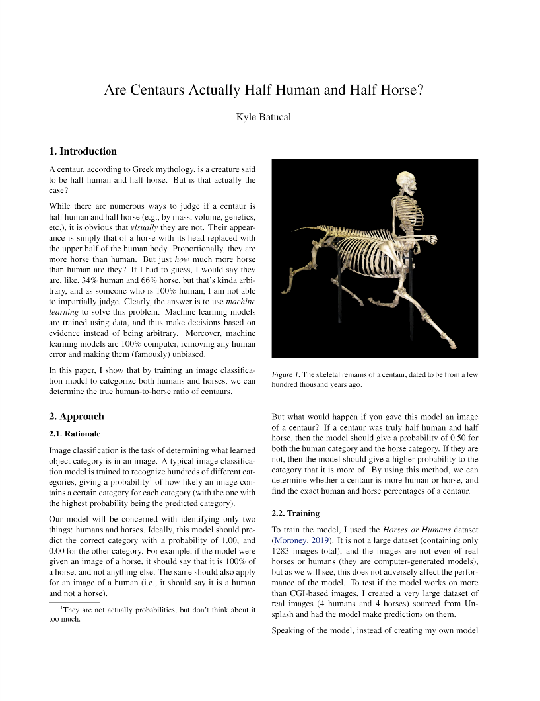

# Centaur Image Classifier

Ever thought that a centaur isn't actually half horse and half human? Using **machine learning**, we very rigorously prove that centaurs are actually more horse than human.

You can read my very serious research paper about it in the [**SIGBOVIK 2024** proceedings](https://www.sigbovik.org/2024/proceedings.pdf), or [check out the notebook](https://github.com/kylebatucal/centaur-classifier/blob/main/centaur_classifier.ipynb) if you would like to reproduce the results yourself.

Preview:

